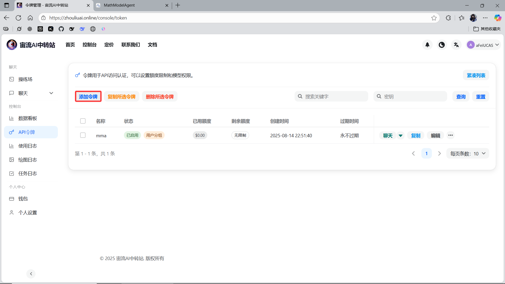
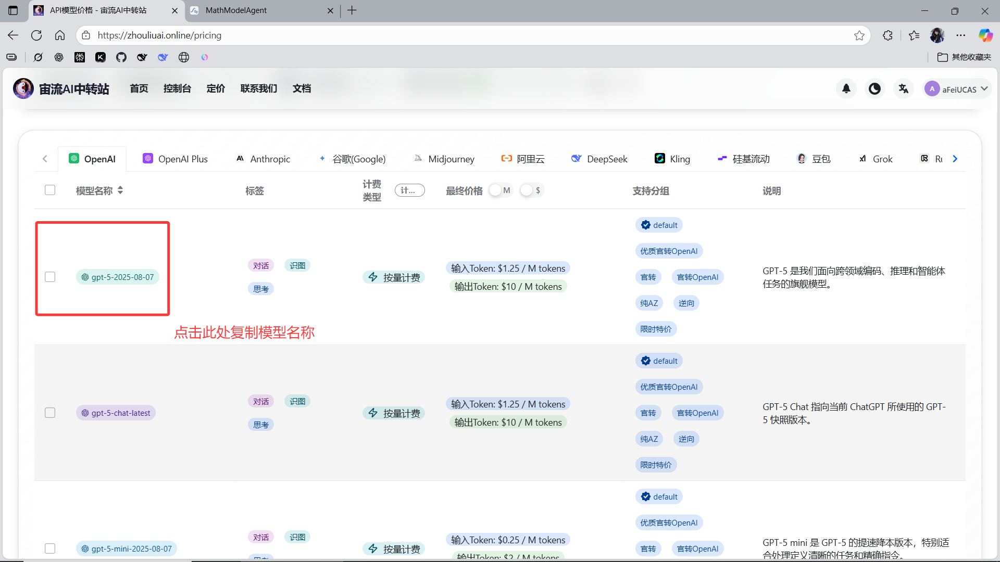
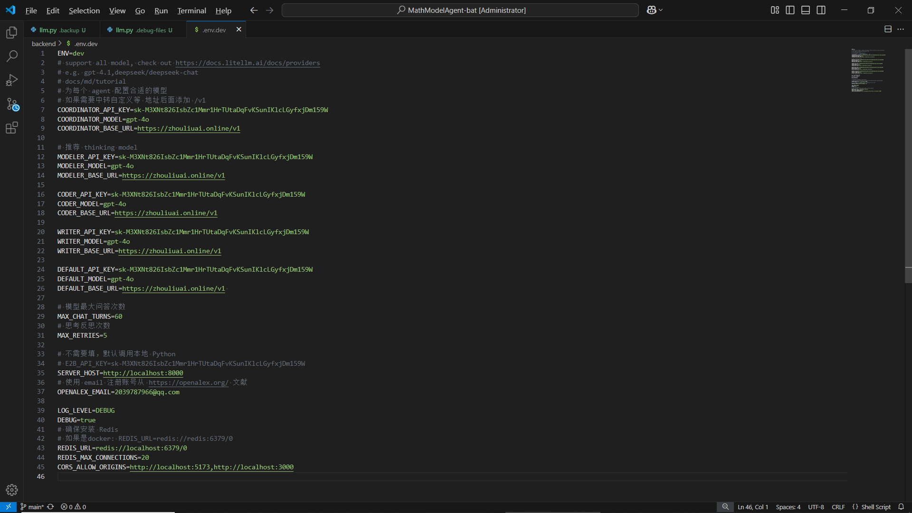
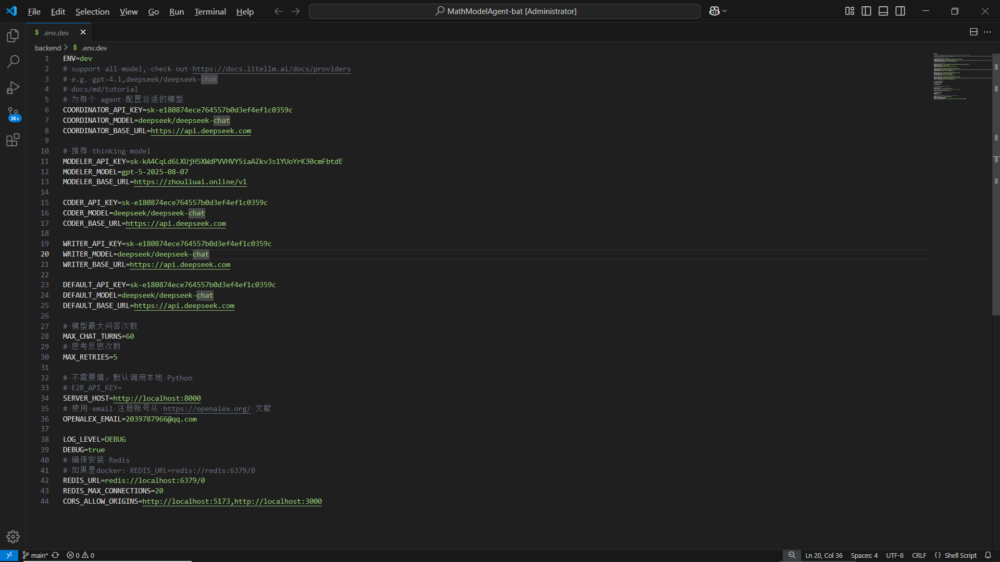

# 可行的中转方案-1

所用网站：https://zhouliuai.online/
## API令牌添加令牌



## 定价处复制模型名



## 填写模型配置文件如[可行的中转方案-1-1-.env.dev](./可行的中转方案-1-1-.env.dev)



​      由此，运行后尝试多次出错如下（更详细的报错见[error-logs.txt](./.intermediate-files/error-logs.txt))

```python
ERROR:    Exception in ASGI application
Traceback (most recent call last):
  File "E:\repo2\MathModelAgent-bat\backend\.venv\Lib\site-packages\uvicorn\protocols\http\httptools_impl.py", line 409, in run_asgi
    result = await app(  # type: ignore[func-returns-value]
             ^^^^^^^^^^^^^^^^^^^^^^^^^^^^^^^^^^^^^^^^^^^^^^

...

  File "D:\Python3.12.9\Lib\re\__init__.py", line 186, in sub
    return _compile(pattern, flags).sub(repl, string, count)
           ^^^^^^^^^^^^^^^^^^^^^^^^^^^^^^^^^^^^^^^^^^^^^^^^^
TypeError: expected string or bytes-like object, got 'NoneType'
agent_name WriterAgent
```

​      经gpt5调研并查看源码发现是该问题**不是数据偶发**，而是**协议层的常见情况**：当模型决定“用工具而不是回答文本”时，`content=None` 是完全正常的。而当前实现默认「一定有文本」，所以每次遇到工具调用分支都会崩。日志也显示了这条路径：CoderAgent 第一次 EDA 子任务就触发了多次 `execute_code` 的 tool call，随之 `msg.content: None` 被发布到 Redis，接着 `split_footnotes(None)` 直接类型错误。

​      修改`llm.py`与`common_utils.py`文件后 [对话ID及输出](./.intermediate-files/20250814-233425-d5fbc657.json)记录在此。MathModelAgent 终端运行正常直至因额度用尽报错如下：

```python
Give Feedback / Get Help: https://github.com/BerriAI/litellm/issues/new
LiteLLM.Info: If you need to debug this error, use `litellm._turn_on_debug()'.

On Async Failure
ERROR:    Exception in ASGI application
Traceback (most recent call last):
  File "E:\repo2\MathModelAgent-bat\backend\.venv\Lib\site-packages\litellm\llms\openai\openai.py", line 790, in acompletion
    headers, response = await self.make_openai_chat_completion_request(
                        ^^^^^^^^^^^^^^^^^^^^^^^^^^^^^^^^^^^^^^^^^^^^^^^
  File "E:\repo2\MathModelAgent-bat\backend\.venv\Lib\site-packages\litellm\litellm_core_utils\logging_utils.py", line 135, in async_wrapper
    result = await func(*args, **kwargs)
             ^^^^^^^^^^^^^^^^^^^^^^^^^^^

...

  File "E:\repo2\MathModelAgent-bat\backend\.venv\Lib\site-packages\litellm\litellm_core_utils\exception_mapping_utils.py", line 2232, in exception_type
    raise e
  File "E:\repo2\MathModelAgent-bat\backend\.venv\Lib\site-packages\litellm\litellm_core_utils\exception_mapping_utils.py", line 467, in exception_type
    raise APIError(
litellm.exceptions.APIError: litellm.APIError: APIError: OpenAIException - user quota is not enough (request id: 202508142336245664973333OV93TUg)
```

修改后的文件备份如下：[修改后的common_utils.py文件](./.debug-files/common_utils.py)、[修改后的llm.py文件](./.debug-files/llm.py)
修改前的文件备份如下：[修改前的common_utils.py文件](./.backup-files/common_utils.py)、[修改前的llm.py文件](./.backup-files/llm.py)

可能是我全部填写agent为gpt-4o的缘故总报上述第一个代码块的错误，经子木同学上传配置填写除thinking填写chatgpt5模型，其余模型填写deepseek模型后无报错。相关配置文件如[可行的中转方案-1-2-.env.dev](可行的中转方案-1-2-.env.dev)



该文件作中转探索的记录。仅供参考，切勿当作标准。

